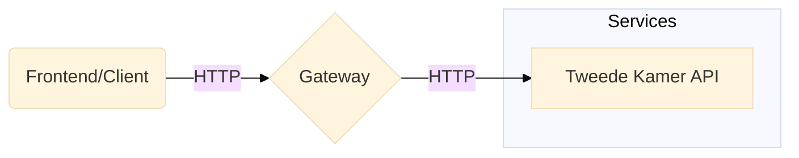

# Parlio GraphQL Gateway

This is the [GraphQL gateway](https://www.apollographql.com/docs/federation/gateway/) used by Parlio.

## Architecture

The diagram below illustrates the environment in which the gateway operates.



## Yarn

Please install Yarn via `npm install -g yarn`.

The `node_modules` folder can be created by running `yarn install`.

## Development environment

Running the development environment requires three separate commands (probably in different terminal windows):

1. Use `tsc:watch` to start the TypeScript compiler in watch mode
2. Use `supergraph:watch` to watch for changes in the `rover/subgraphs` folder, or `rover/config/development.yaml`
   configuration
3. Use `yarn dev` to start the development environment using `nodemon`

## Rover CLI

The [Rover CLI](https://www.apollographql.com/docs/rover/) is a tool created by [Apollo](https://www.apollographql.com/)
to facilitate schema introspection
and [federated graph composition](https://www.apollographql.com/docs/federation/#federated-schemas). The Rover CLI must
be installed manually and is _not_ installed by running `yarn install`.

The gateway uses Apollo Federation **2**. You may need
to [install the `rover-fed2` plugin](https://www.apollographql.com/docs/federation/v2/federation-2/moving-to-federation-2/#using-the-rover-cli)
.

### PowerShell

To use Rover CLI with PowerShell we must configure UTF-8.

This step is _not_ necessary when using [PowerShell **Core**](https://github.com/powershell/powershell).

```shell
$OutputEncoding = [System.Console]::OutputEncoding = [System.Console]::InputEncoding = [System.Text.Encoding]::UTF8
$PSDefaultParameterValues['*:Encoding'] = 'utf8'
```

### Fetching a subgraph

```shell
rover subgraph introspect http://localhost:8080/graphql > rover/subgraph/my-subgraph-name.graphql
```

### Compose subgraph's

Individual schema can be composed into a supergraph by running `yarn supergraph:prod` (for production changes)
or `yarn supergraph:dev` (for development changes).

The configuration files for these two composition operations live in the `rover/config` folder.

## Prettier

Please run `yarn fmt` before committing.
